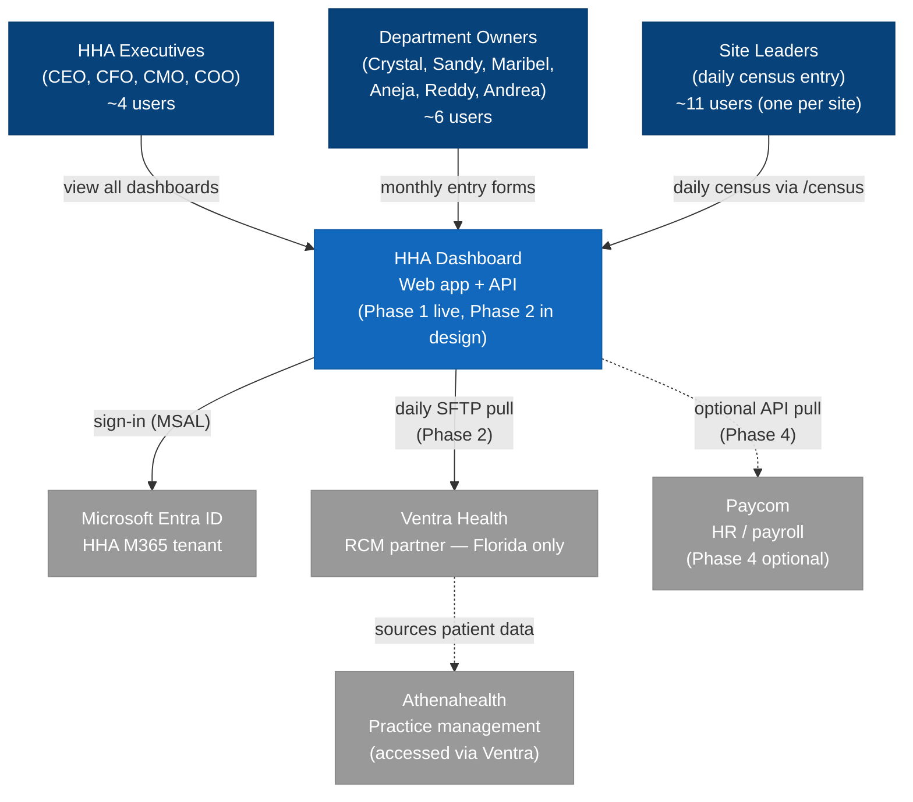
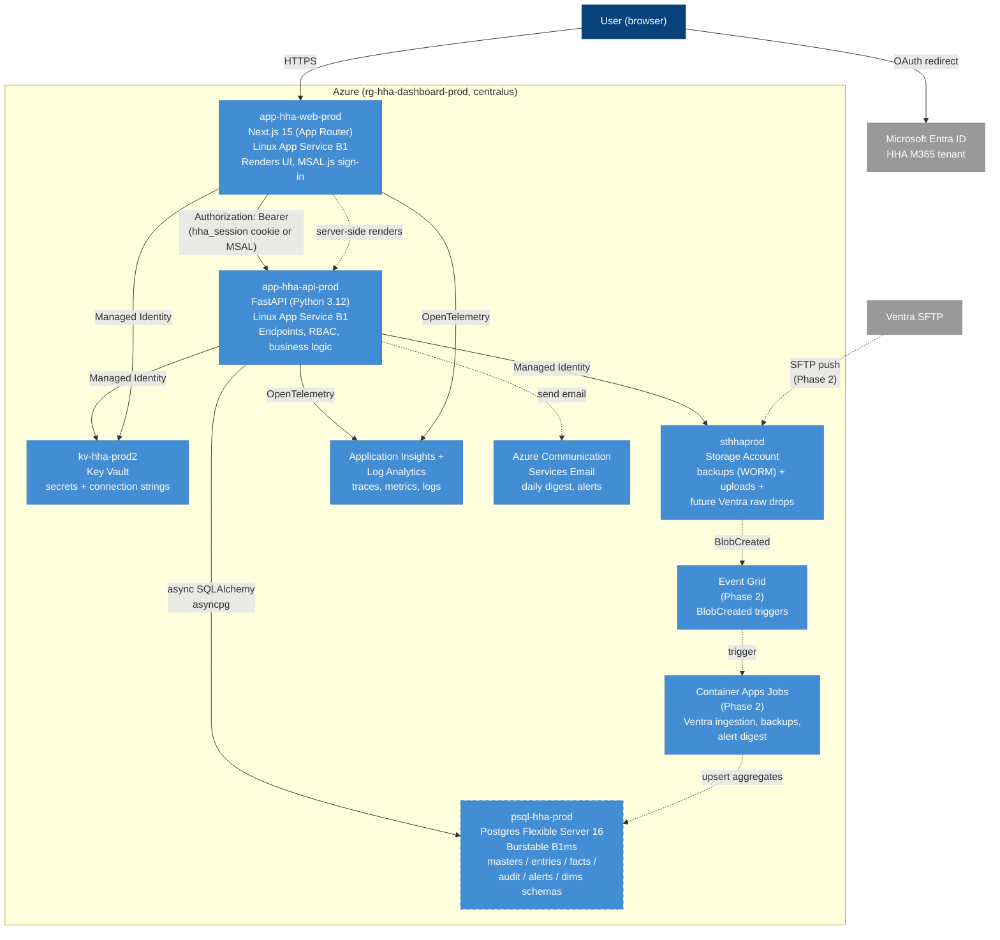
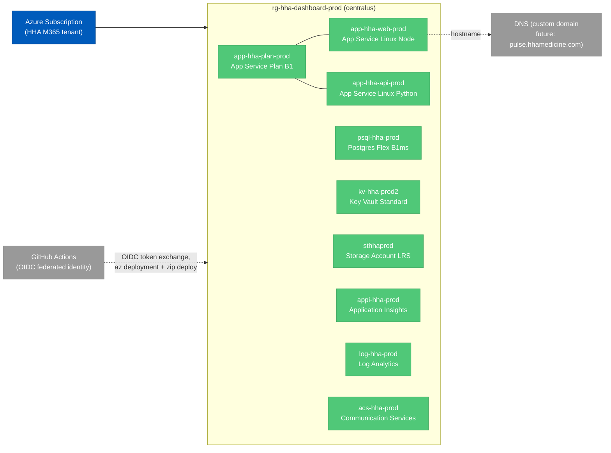
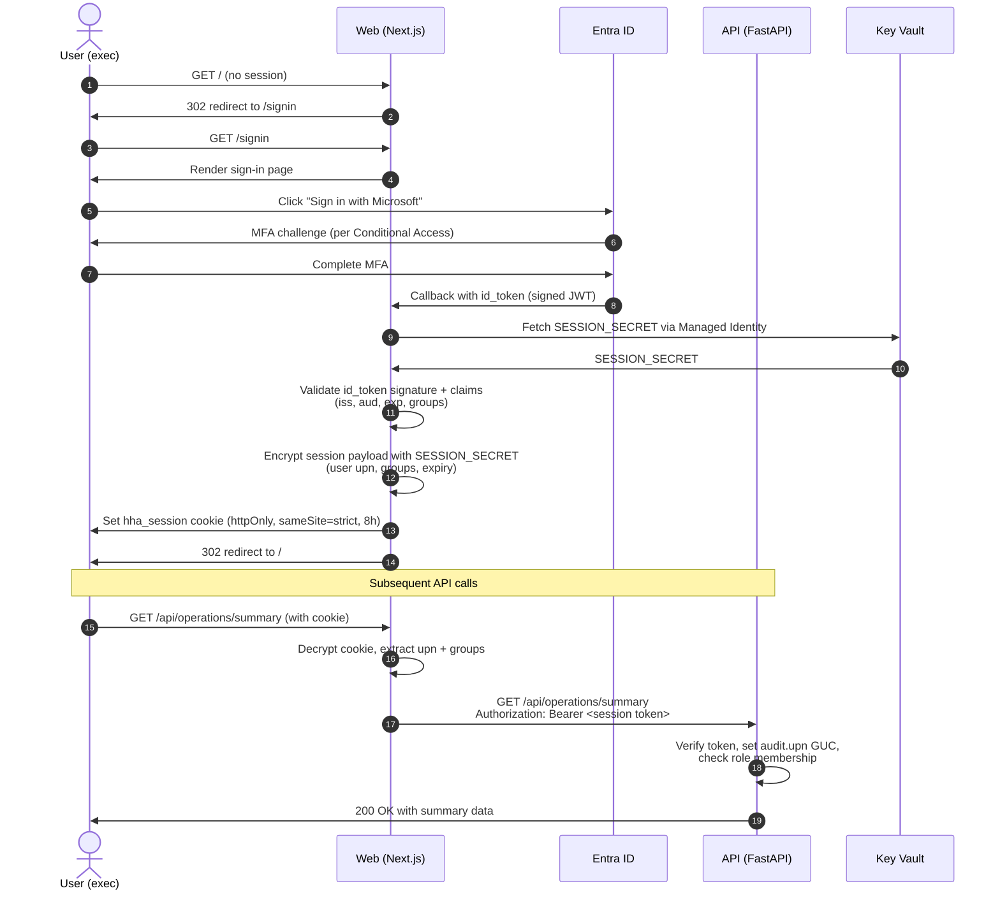
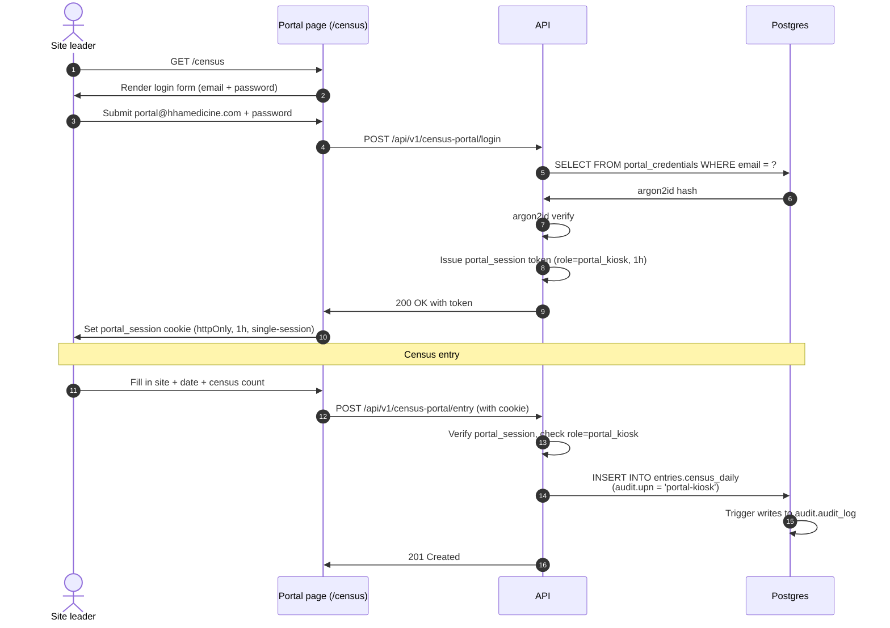
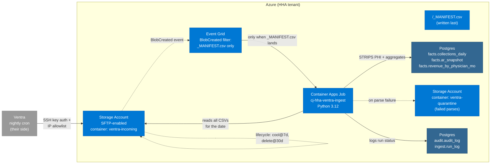
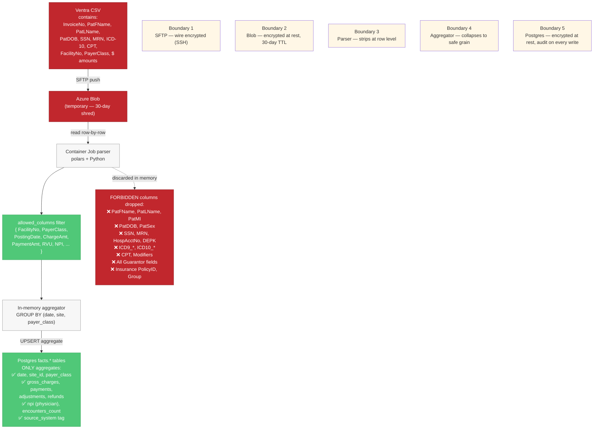
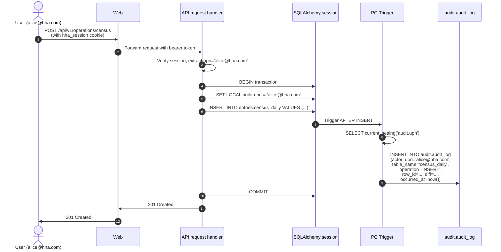
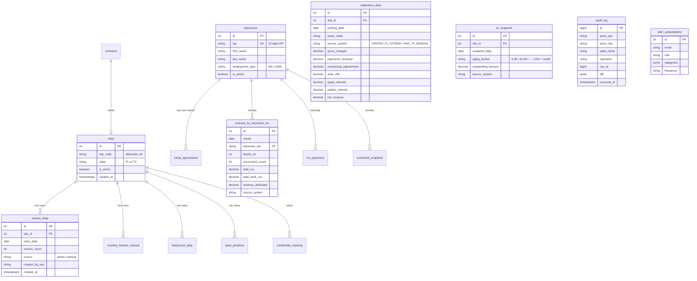
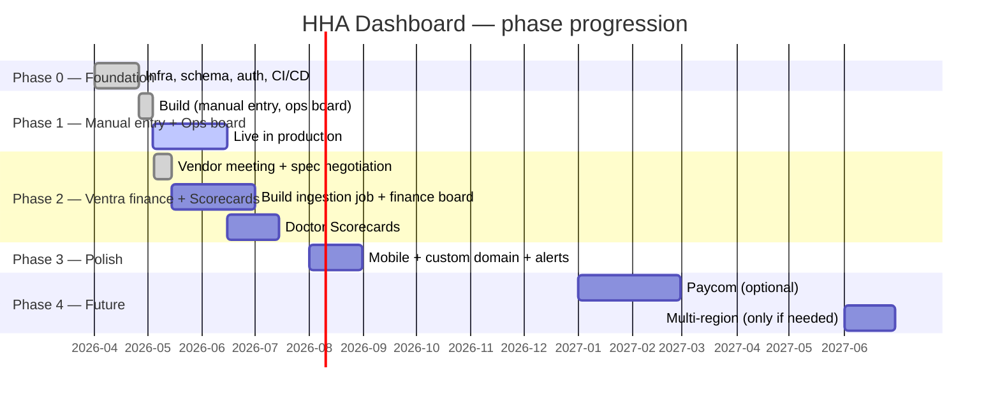

# Architecture diagrams

> **Visual reference for the HHA Dashboard architecture.** Pair with the narrative deep-dive in [ARCHITECTURE.md](ARCHITECTURE.md). All diagrams are Mermaid (text-based, version-controlled, rendered natively on GitHub). To render in SharePoint/PDF, run [scripts/export-to-pdf.sh](../scripts/export-to-pdf.sh).
>
> Last updated 2026-05-11.

## Diagram index

1. [System context (C4 Level 1)](#1-system-context-c4-level-1) — who talks to what
2. [Container diagram (C4 Level 2)](#2-container-diagram-c4-level-2) — what's inside
3. [Deployment topology](#3-deployment-topology) — Azure resources
4. [Entra ID auth flow](#4-entra-id-auth-flow) — exec sign-in
5. [Census portal auth flow](#5-census-portal-auth-flow) — kiosk login
6. [Ventra ingestion data flow](#6-ventra-ingestion-data-flow) — Phase 2
7. [HIPAA firewall flow](#7-hipaa-firewall-flow) — what gets stripped where
8. [Audit chain](#8-audit-chain) — who-did-what-when propagation
9. [Schema ERD](#9-schema-erd) — Postgres relationships
10. [Phase progression timeline](#10-phase-progression-timeline)

---

## 1. System context (C4 Level 1)

The top-level view: who uses HHA Dashboard, and what external systems it depends on.

**Key facts in this diagram:**

- **20 users max.** Not a public system.
- **Entra ID** is the only auth provider — there's no separate password store.
- **Ventra is Florida-only.** Texas operations are manual entry inside the dashboard (per ADR-005).
- **Paycom is dashed** because it's a future Phase 4 integration, not built.

---

## 2. Container diagram (C4 Level 2)

What's inside the "HHA Dashboard" box from the system context.

**Key facts in this diagram:**

- **Two App Services**: `app-hha-web-prod` (Next.js) and `app-hha-api-prod` (FastAPI). Both Linux B1 tier.
- **Managed Identity everywhere** — no static secrets. Web and API authenticate to Key Vault and Storage via their App Service identity.
- **The dashed boxes (Event Grid, Container Apps Jobs)** are Phase 2 additions — not yet provisioned.
- **`hha_session` cookie** carries auth between web and API; httpOnly + sameSite=strict.

---

## 3. Deployment topology

Where the Azure resources sit.

**Key facts:**

- **One resource group, one region.** No multi-region (deferred to Phase 4).
- **No VNet today** — direct public endpoints with firewall rules. Phase 3 may add VNet.
- **GitHub Actions deploys** via OIDC federated identity — no stored credentials.

---

## 4. Entra ID auth flow

How an executive signs in to the dashboard.

**Key facts:**

- The browser **never sees the raw id_token** — it's encrypted into the `hha_session` cookie on the server.
- The cookie is **httpOnly** so JavaScript can't read it (XSS protection).
- The API **re-verifies** the session token on every request — no implicit trust.
- The `audit.upn` GUC is set per-request so audit triggers capture identity.

See [ENTRA_SETUP.md](../03-engineering/ENTRA_SETUP.md) for the one-time Entra app registration steps.

---

## 5. Census portal auth flow

The census portal (Phase 1) uses a **shared kiosk credential**, not individual Entra sign-in. This is by design — site leaders use this on shared workstations.

**Key facts:**

- **Single shared credential** for all site leaders. Not per-user.
- **`role=portal_kiosk`** restricts the session to only the census-entry endpoint — no access to dashboards.
- **`audit.upn = 'portal-kiosk'`** in the audit log so we know it came from the portal even though we don't know which human.
- See [PHASE_1_CENSUS_PORTAL.md](../05-product/PHASE_1_CENSUS_PORTAL.md) and [adr/002-rbac-model.md](adr/002-rbac-model.md) for the threat model.

---

## 6. Ventra ingestion data flow

Phase 2. Ventra pushes daily CSVs via SFTP; we trigger an aggregation job on receipt.

**Key facts:**

- **Manifest-triggered** — Event Grid only fires the job when `_MANIFEST.csv` lands, never on individual data files. This prevents picking up half-complete drops.
- **PHI is stripped before any database write** (see diagram 7).
- **Raw files have a 30-day Blob lifecycle** then auto-delete. We never persist raw rows in Postgres.
- **Failed parses go to a quarantine container** for investigation.

Full architecture in [INGESTION_VENTRA.md](../03-engineering/INGESTION_VENTRA.md).

---

## 7. HIPAA firewall flow

The single most important diagram for compliance. Shows what gets stripped where.

**Key facts:**

- **5 defense-in-depth boundaries.** PHI has to cross all 5 to leak — and one of them (the parser) is enforced by a strict allowlist, not a denylist.
- **Allowlist, not denylist.** If Ventra adds a new column we don't know about, it's automatically excluded.
- **Aggregation collapses identity.** Even if a column slipped through, GROUP BY (date, site, payer_class) loses any per-patient resolution.

Full HIPAA detail in [adr/001-hipaa-data-classification.md](adr/001-hipaa-data-classification.md) and [COMPLIANCE_POSTURE.md](../01-leadership/COMPLIANCE_POSTURE.md).

---

## 8. Audit chain

How "who did what when" gets captured at the database level.

**Key facts:**

- **`audit.upn` is a Postgres session GUC** — set inside the transaction, read by the trigger. Survives across raw SQL and async operations within the same session.
- **Triggers fire on every mutation path**: ORM, raw SQL, cron jobs. If you can write a row, the trigger captures it.
- **`audit.audit_log` has no DELETE permission for app users.** Rows are append-only.
- **Daily backups include audit log**, stored in WORM Blob.

ADR-003 covers the technical design: [adr/003-audit-chain.md](adr/003-audit-chain.md).

---

## 9. Schema ERD

Postgres schemas and their relationships. Six logical schemas; physically all in one database.

**Key facts about schemas:**

| Schema | Purpose |
|---|---|
| `masters` | Reference data: `sites`, `physicians`, `contracts`, `payer_class_map` |
| `entries` | Manual entry data: `census_daily`, `monthly_finance_manual`, `open_positions` |
| `facts` | Aggregated facts from automated sources: `collections_daily`, `ar_snapshot`, `revenue_by_physician_mo`, `headcount_daily`, `terminations`, `rvu_paycheck` |
| `audit` | Audit log: `audit_log` |
| `alerts` | Alert routing: `alert_subscriptions`, `alert_history` |
| `dims` | Dimension tables (Phase 2+): `payer_class`, `facility_codes` |

Full table-by-table reference in [DATA_MODEL.md](DATA_MODEL.md).

---

## 10. Phase progression timeline

**Critical-path bottleneck:** Ventra spec negotiation. We sent a counter-proposal (Option A pre-aggregated CSVs) on 2026-05-11; awaiting response post-PTO (Gilda back 2026-05-14). Phase 2 build start date depends on this.

---

## How to update these diagrams

1. Edit the Mermaid code blocks in this file
2. Preview locally — VS Code has a Mermaid preview extension, or paste into https://mermaid.live
3. Commit with message `docs(diagrams): update <which diagram> for <what changed>`
4. For SharePoint upload, regenerate PDFs via `scripts/export-to-pdf.sh`

## How to add a new diagram

1. Insert a new top-level `## N. <Title>` section
2. Add the entry to the index at the top of this file
3. Place the Mermaid block, then 2 paragraphs of explanation
4. Cross-link from the most relevant narrative doc

---

**Next read:** [DATA_MODEL.md](DATA_MODEL.md) for the table-by-table reference.
